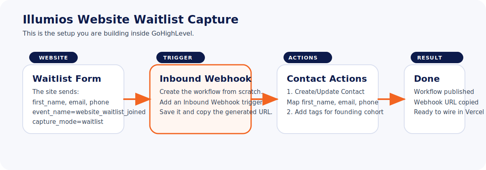
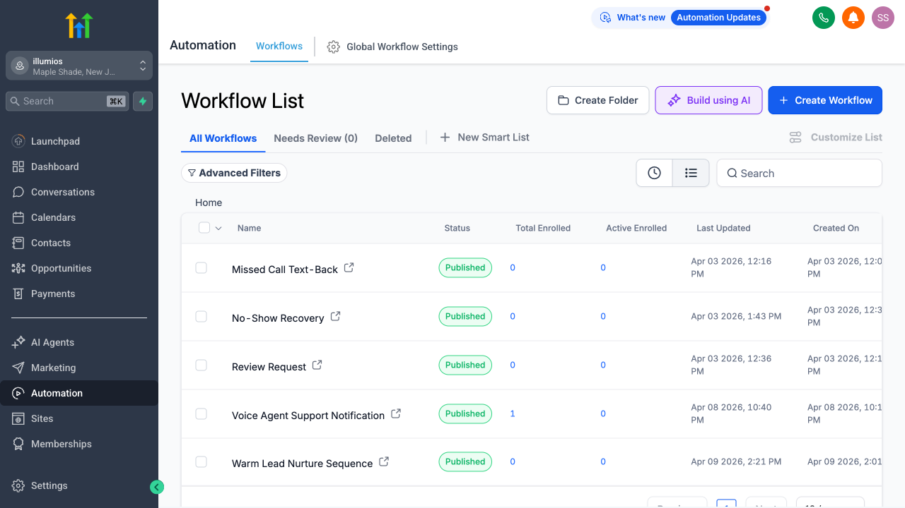
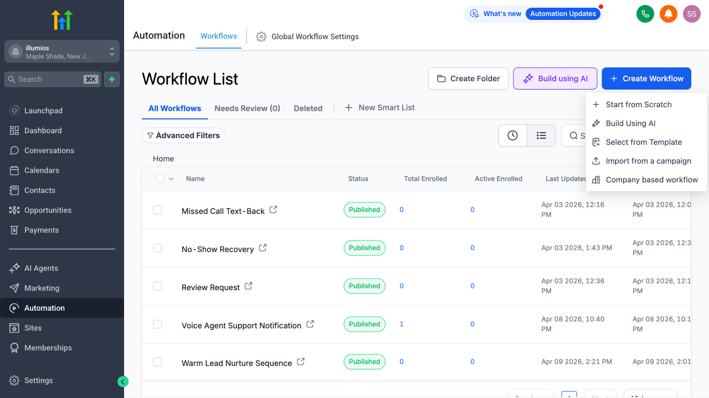

# GHL Website Waitlist Workflow Guide

## Status

This workflow-based approach is no longer the preferred implementation for the website.

Reason:

- GHL marks the `Inbound Webhook` trigger as a premium trigger with extra per-execution cost
- the website already has a server-side Vercel route, which is a better long-term integration point

Preferred direction now:

- website -> Vercel server route -> GHL REST API

Keep this guide only as a fallback reference if a workflow-based handoff is ever explicitly needed again.

This guide walks you through the exact GHL setup needed for the current Illumios website waitlist flow.

Legacy goal:

- create a live HighLevel workflow with an `Inbound Webhook` trigger
- make sure it creates or updates the contact correctly
- tag the lead as a website waitlist lead
- copy the generated webhook URL and send it back to me

## What We Are Building

The website is already set to send waitlist submissions with this event:

- `event_name=website_waitlist_joined`

The current website payload includes:

- `first_name`
- `email`
- `phone`
- `event_name`
- `source`
- `offer`
- `location_id`
- `page_url`
- `tags`
- `capture_mode`
- `payload_json`

Recommended workflow name:

- `Website Waitlist Inbound Capture`

Recommended minimum actions:

1. `Create/Update Contact`
2. `Add Contact Tags`
3. optional internal notification

## Visual Overview

## Step 1: Open The Workflows Screen

Make sure you are inside the Illumios location, not the agency-level view.

You should see:

- location name: `illumios`
- location context: `Maple Shade, New Jersey`
- left nav item: `Automation`
- top tab: `Workflows`

Reference:

## Step 2: Create A New Workflow

In the top-right area:

1. Click `Create Workflow`
2. Choose `Start from Scratch`

Reference:

## Step 3: Name The Workflow

Use this exact name for now:

- `Website Waitlist Inbound Capture`

This keeps it easy to identify when we wire the site and test the live handoff.

## Step 4: Add The Trigger

Choose:

- `Inbound Webhook`

Then save the trigger.

Important:

- after you save it, GHL will generate a webhook URL
- copy that URL
- this is the main thing I need back from you

## Step 5: Add The Contact Action

Add a new action:

- `Create/Update Contact`

If your account shows a slightly different label, use the contact upsert action that updates an existing contact instead of blindly duplicating one.

Map the inbound webhook fields into the contact action:

- First Name -> `first_name`
- Email -> `email`
- Phone -> `phone`

If GHL asks how to match or deduplicate contacts, prefer:

- email first
- phone as secondary if available

## Step 6: Add The Tag Action

Add another action:

- `Add Contact Tags`

Use these tags:

- `academia-interest`
- `illumios-academia`
- `founding-cohort`
- `website-waitlist`

This matches the current website waitlist positioning and keeps these leads easy to segment later.

## Step 7: Optional Internal Notification

This part is optional for now.

If you want a simple visibility step, add:

- internal notification

Suggested notification message:

`New website waitlist lead: {{contact.first_name}} - {{contact.email}}`

If you want to keep this first pass minimal, you can skip this step.

## Step 8: Publish The Workflow

Make sure the workflow is not left in draft.

You want:

- workflow saved
- workflow published
- webhook trigger active

## What To Send Back To Me

Once you finish, send me:

1. the full inbound webhook URL
2. a quick note that the workflow is published

That is enough for me to wire the repo config and help you test the first live submission.

## Recommended Minimal Setup Summary

Use this exact structure:

1. Workflow name: `Website Waitlist Inbound Capture`
2. Trigger: `Inbound Webhook`
3. Action: `Create/Update Contact`
4. Action: `Add Contact Tags`
5. Publish workflow
6. Copy webhook URL

## Quick Sanity Check

If GHL lets you inspect sample webhook fields after the trigger is created, these are the most important ones to watch for later:

- `event_name`
- `first_name`
- `email`
- `tags`
- `capture_mode`

For the live website waitlist flow, the key expected values are:

- `event_name=website_waitlist_joined`
- `capture_mode=waitlist`

## If This Fallback Is Ever Used

I would then handle the next step by:

- deciding whether the fallback webhook path is really necessary
- confirming `ILLUMIOS_GHL_LOCATION_ID`
- helping run a real waitlist submission test
